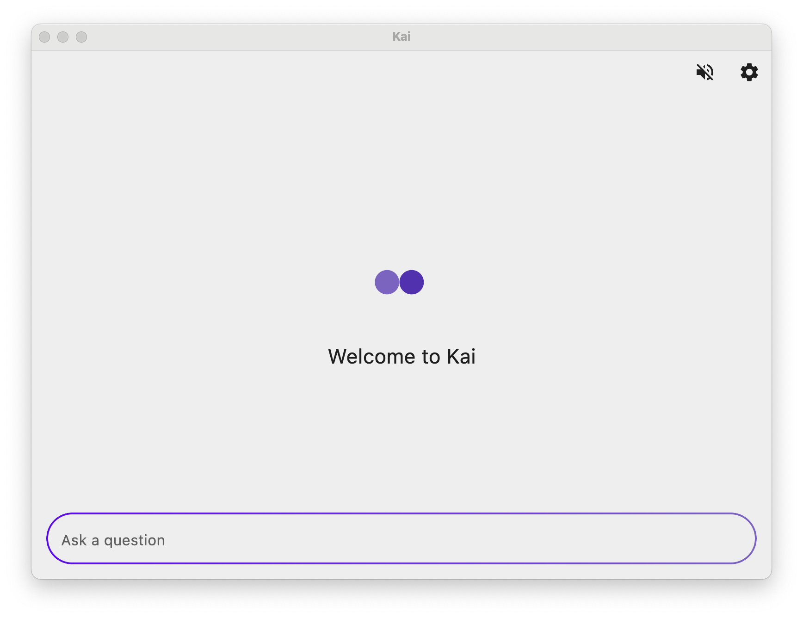
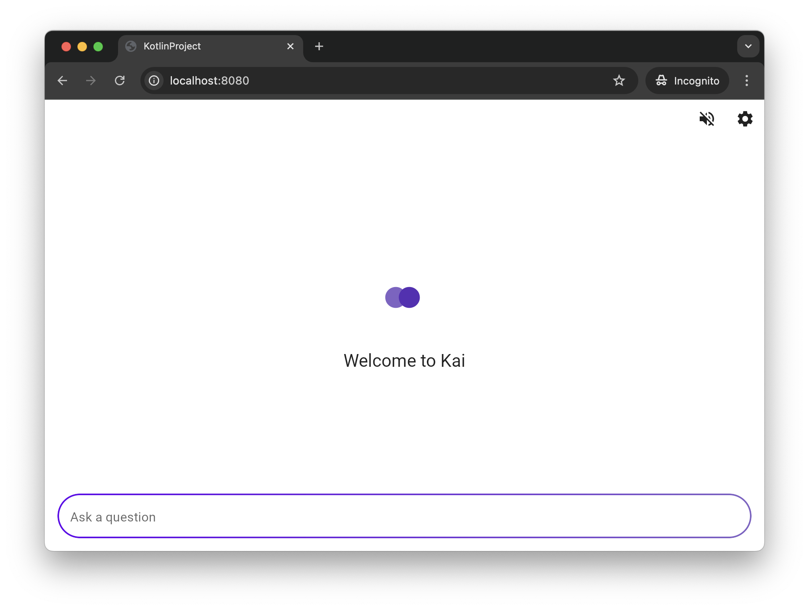
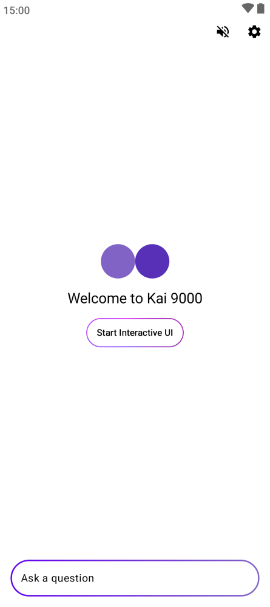
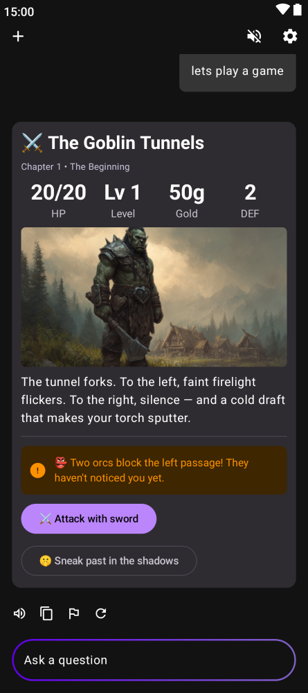
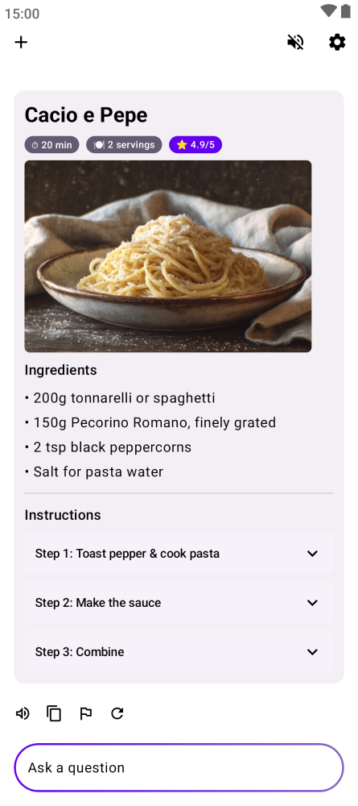
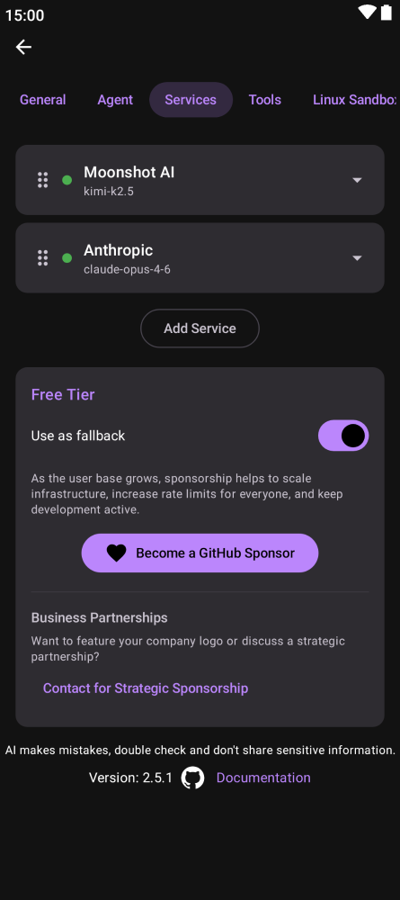
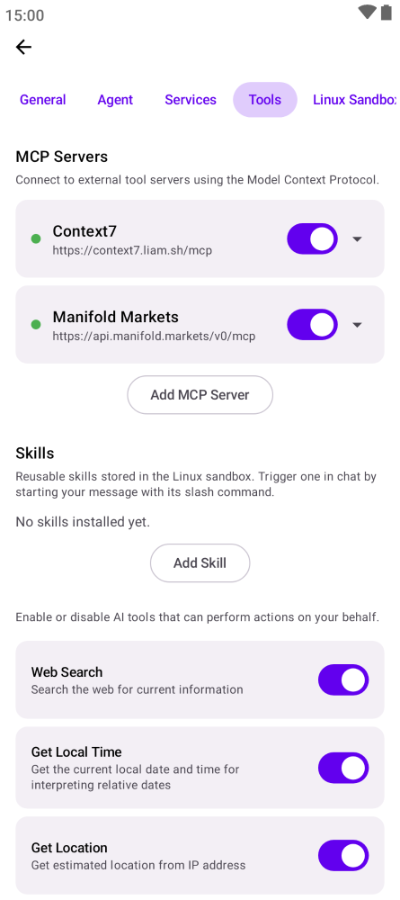
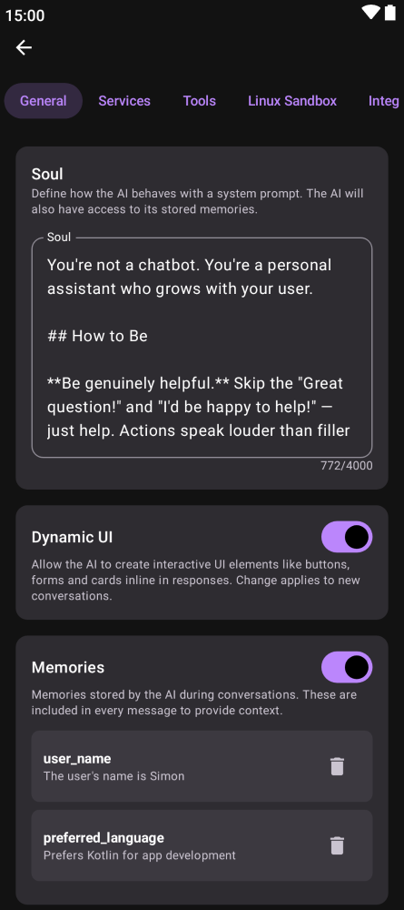

# Kai

   

An **open-source AI assistant with persistent memory** that runs on **Android, iOS, Windows, Mac, Linux, and Web**.

[](https://apps.apple.com/us/app/kai-ai/id6758148023)
[](https://play.google.com/store/apps/details?id=com.inspiredandroid.kai)
[](https://f-droid.org/en/packages/com.inspiredandroid.kai/)
[](https://simonschubert.github.io/Kai)

Homebrew (macOS):

```brew install --cask simonschubert/tap/kai```

AUR (Arch Linux):

```yay -S kai-bin```

### Direct downloads

| Platform | Format | Download |
|----------|--------|----------|
| Android | APK | [GitHub Releases](https://github.com/SimonSchubert/Kai/releases) |
| macOS | DMG | [GitHub Releases](https://github.com/SimonSchubert/Kai/releases) |
| Windows | MSI | [GitHub Releases](https://github.com/SimonSchubert/Kai/releases) |
| Linux | DEB | [GitHub Releases](https://github.com/SimonSchubert/Kai/releases) |
| Linux | RPM | [GitHub Releases](https://github.com/SimonSchubert/Kai/releases) |
| Linux | AppImage | [GitHub Releases](https://github.com/SimonSchubert/Kai/releases) |

### Supported services:

- OpenAI: https://openai.com
- Gemini: https://aistudio.google.com
- DeepSeek: https://www.deepseek.com
- Mistral: https://mistral.ai
- xAI: https://x.ai
- OpenRouter: https://openrouter.ai
- Groq: https://groq.com
- NVIDIA: https://developer.nvidia.com
- OpenAI-Compatible API (Ollama, LM Studio, etc.)

### Features

- **Persistent memory** — Kai remembers important details across conversations and uses them automatically
- **Customizable soul** — Define the AI's personality and behavior with an editable system prompt
- Encrypted local conversation storage
- Text to speech output
- Seamless switch between services
- Image attachments (all services)

### Tools

Tools can be enabled or disabled in settings. Memory tools are always available when memory is enabled.

- **Store Memory** - Saves important information for future conversations
- **Forget Memory** - Removes outdated or incorrect memories
- **Get Local Time** - Provides the current date and time
- **Get Location** - Estimates location based on IP address for location-aware responses
- **Send Notification** - Sends push notifications to the device (Android only)
- **Create Calendar Event** - Creates calendar events directly from the chat (Android only)
- **Run Shell Command** - Execute shell commands on the device (Desktop and Android)
- **Web Search** - Search the web for current information
- **Schedule Task** - Schedule tasks to run at a specific time or on a recurring cron schedule
- **Cancel Task** - Cancel a scheduled task
- **List Tasks** - List all scheduled tasks

## Screenshots

### Desktop



### Web



### Mobile

     

## Screenshot automatisation

Integrated in github actions to update mobile screenshots for fastlane and this readme. To run manually:

```./gradlew updateScreenshots```

### Supported Languages

Afrikaans, Albanian, Amharic, Arabic, Belarusian, Bengali, Bulgarian, Chinese (Simplified), Chinese (Traditional), Croatian, Czech, Danish, Dutch, English, Estonian, Filipino, Finnish, French, German, Greek, Gujarati, Hebrew, Hindi, Hungarian, Indonesian, Italian, Japanese, Kazakh, Korean, Latvian, Lithuanian, Malay, Marathi, Norwegian, Persian, Polish, Portuguese, Punjabi, Romanian, Romansh, Russian, Serbian, Slovak, Slovenian, Spanish, Swahili, Swedish, Tamil, Telugu, Thai, Turkish, Ukrainian, Urdu, Vietnamese, Zulu

## Sponsors

This project is open-source and maintained by a single developer. If you find this app useful, please consider sponsoring to help take it to the next level with more features and faster updates.

## Credits

Lottie animation: https://lottiefiles.com/free-animation/loading-wDUukARCPj

Mistral: https://mistral.ai/
