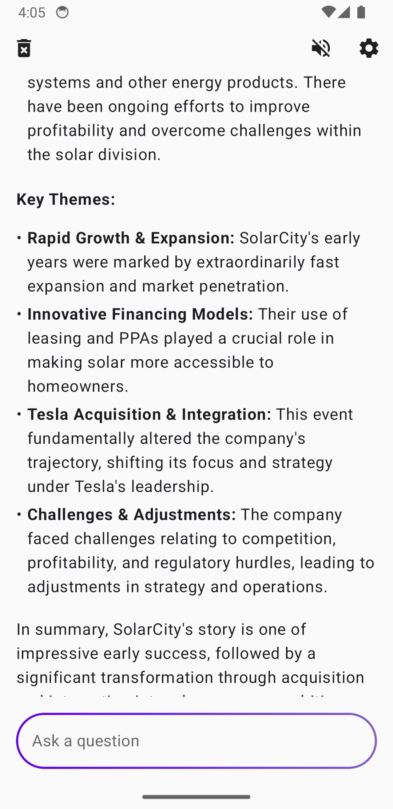
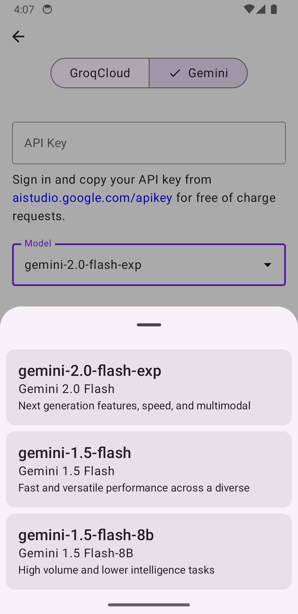
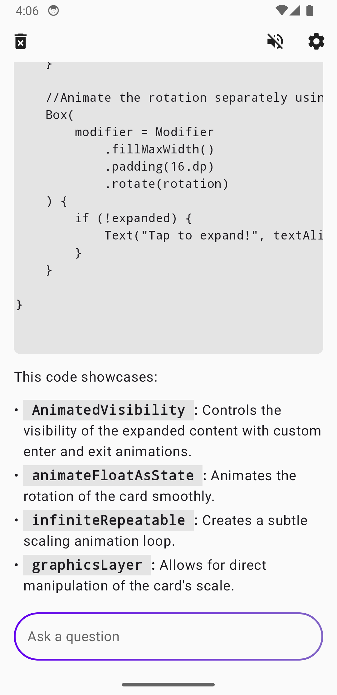

# Kai

   

A **cross-platform open-source AI interface** that runs on **Android, iOS, Windows, Mac, Linux, and Web**.

### Downloads

| Platform | Format | Download |
|----------|--------|----------|
| Android | APK | [GitHub Releases](https://github.com/SimonSchubert/Kai/releases) |
| macOS | DMG | [GitHub Releases](https://github.com/SimonSchubert/Kai/releases) |
| Windows | MSI | [GitHub Releases](https://github.com/SimonSchubert/Kai/releases) |
| Linux | DEB | [GitHub Releases](https://github.com/SimonSchubert/Kai/releases) |
| Linux | RPM | [GitHub Releases](https://github.com/SimonSchubert/Kai/releases) |
| Linux | AppImage | [GitHub Releases](https://github.com/SimonSchubert/Kai/releases) |

### Supported services and models:

- Gemini 2.5 Flash, Gemini 3 Pro...
- Groq: Llama series, GPT-OSS series, Groq Compound and more

For the complete, up-to-date list of available models, see: https://console.groq.com/docs/models

## Screenshots

### Desktop

### Web

### Mobile

   

## Sponsors

This project is open-source and maintained by a single developer. If you find this app useful, please consider sponsoring to help take it to the next level with more features and faster updates.

## Credits

Lottie animation: https://lottiefiles.com/free-animation/loading-wDUukARCPj

GroqCloud: https://groq.com

Gemini: https://gemini.google.com